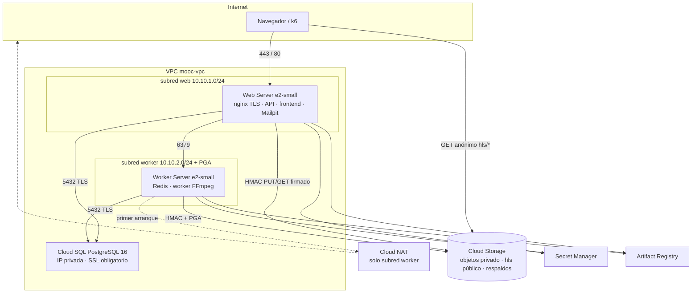

# Modelo de despliegue

Fuente del diagrama (se versiona, no es una captura):
[`despliegue.mmd`](despliegue.mmd).

## Red

VPC en modo custom (la `default` abre SSH/RDP/ICMP a Internet). Dos
subredes regionales: web `10.10.1.0/24` con IP externa estática; worker
`10.10.2.0/24` sin IP externa y con Private Google Access. Cloud SQL
entra por Private Service Access en `10.30.0.0/20`.

SSH solo desde el rango de IAP (`35.235.240.0/20`). No hay puerto 22
abierto a Internet. OS Login decide quién entra y si tiene sudo.

## HTTPS

nginx termina TLS en el Web. Let's Encrypt sobre
`<IP estática>.sslip.io` (o `dominio_web`). Hasta que se emite el
certificado real, uno autofirmado de 30 días. `COOKIE_SECURE=true`.
80 redirige a 443. `X-Forwarded-For` lo pisa nginx con la IP real: el
límite de tasa de la API no se puede falsear con una cabecera.

## Qué no está en el diagrama

El generador de carga **no** es una de las dos VM. Es una
`e2-standard-2` temporal (o el portátil, si la corrida es pequeña), en
la misma región, anotada en cada corrida. Meter k6 en el Web mediría la
contención del generador, no la de la API.
